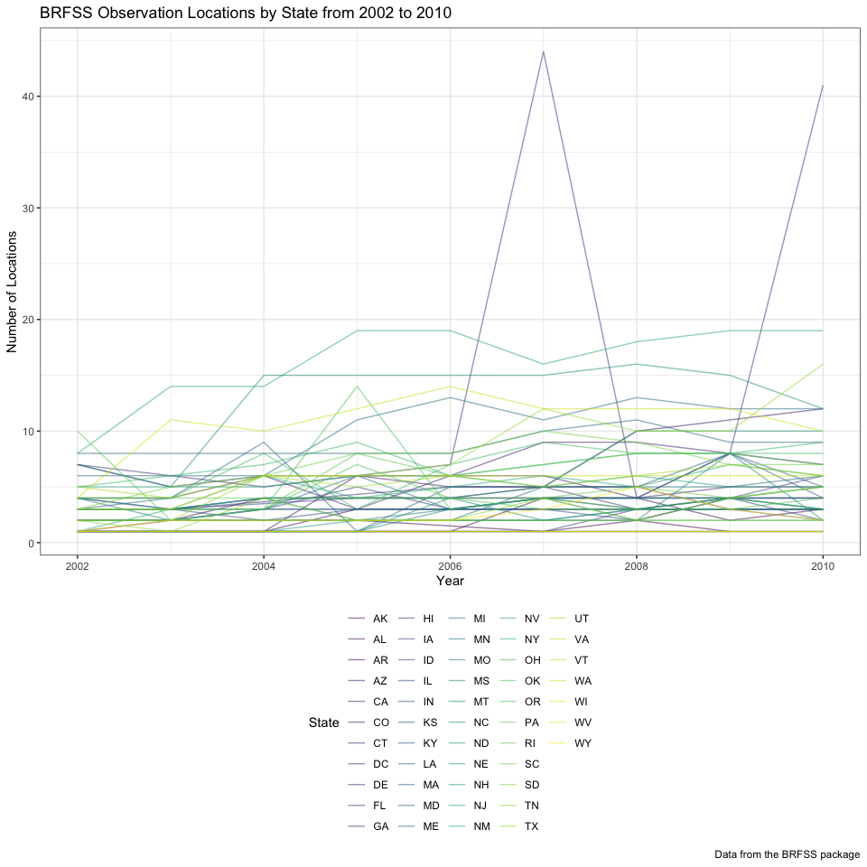
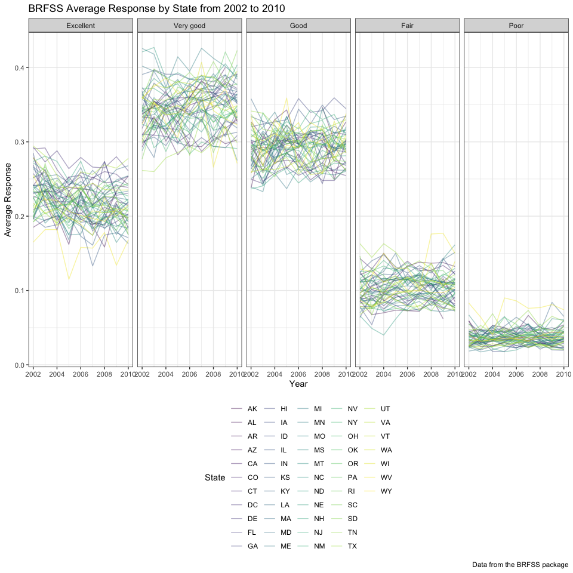
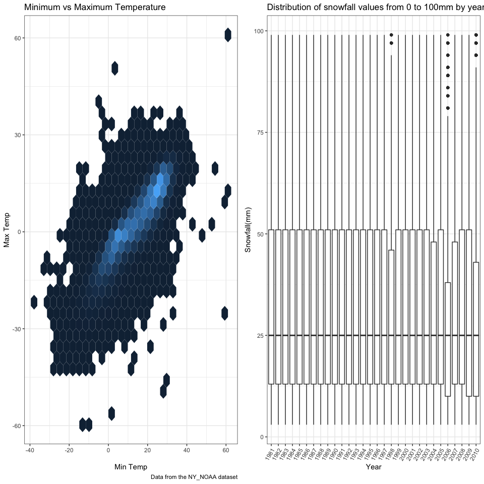

p8105\_hw3\_dk2759
================
Darwin Keung
2018-10-15

``` r
library(tidyverse)
```

    ## ── Attaching packages ──────────────────────────────────────────────────────────────────────────────── tidyverse 1.2.1 ──

    ## ✔ ggplot2 3.0.0     ✔ purrr   0.2.5
    ## ✔ tibble  1.4.2     ✔ dplyr   0.7.6
    ## ✔ tidyr   0.8.1     ✔ stringr 1.3.1
    ## ✔ readr   1.1.1     ✔ forcats 0.3.0

    ## ── Conflicts ─────────────────────────────────────────────────────────────────────────────────── tidyverse_conflicts() ──
    ## ✖ dplyr::filter() masks stats::filter()
    ## ✖ dplyr::lag()    masks stats::lag()

``` r
library(ggridges)
```

    ## 
    ## Attaching package: 'ggridges'

    ## The following object is masked from 'package:ggplot2':
    ## 
    ##     scale_discrete_manual

``` r
library(dplyr)
library(patchwork)
library(hexbin)

knitr::opts_chunk$set(
  fig.width = 10,
  fig.asp = 1.0,
  out.width = "90%"
)

theme_set(theme_bw() + theme(legend.position = "bottom"))
```

Homework 3 Context This assignment reinforces ideas in Visualization and
EDA.

Due date Due: October 15 at 4:00pm.

## Problem 1

This problem uses the BRFSS data.

``` r
library(p8105.datasets)
```

#### Read and clean BRFSS data

Load the BRFSS data from the `p8105.datasets` package.

``` r
data(brfss_smart2010)
```

Cleaning

format the data to use appropriate variable names;

  - focus on the “Overall Health” topic
  - include only responses from “Excllent” to “Poor”
  - organize responses as a factor taking levels ordered from
    “Excellent” to “Poor”

<!-- end list -->

``` r
brfss_smart2010_factor =
  brfss_smart2010 %>% 
  janitor::clean_names() %>% 
  filter(topic == "Overall Health") %>% 
  mutate(response = fct_relevel(response, c("Excellent", "Very good", "Good", "Fair", "Poor"))) %>%
  janitor::clean_names()  %>%
  arrange(response)
```

#### Questions

In 2002, which states were observed at 7 locations? ANS: CT, FL, NC have
7 distinct observation locations.

``` r
brfss_smart2010_factor %>% 
  filter(year == 2002) %>% 
  group_by(locationabbr) %>% 
  distinct(locationdesc) %>% 
  count() %>% 
  filter(n == 7)
```

    ## # A tibble: 3 x 2
    ## # Groups:   locationabbr [3]
    ##   locationabbr     n
    ##   <chr>        <int>
    ## 1 CT               7
    ## 2 FL               7
    ## 3 NC               7

Make a “spaghetti plot” that shows the number of locations in each state
from 2002 to 2010.

``` r
brfss_smart2010_plot = brfss_smart2010_factor %>% 
  group_by(locationabbr, year) %>% 
  distinct(locationdesc) %>%
  summarize(n_obs = n())

ggplot(brfss_smart2010_plot, aes(x = year, y = n_obs)) + 
  geom_line(aes(color = locationabbr), alpha = .5) +
  labs(
    title = "BRFSS Observation Locations by State from 2002 to 2010",
    x = "Year",
    y = "Number of Locations",
    caption = "Data from the BRFSS package"
  ) + 
  viridis::scale_color_viridis(
    name = "State", 
    discrete = TRUE
  )
```



Make a table showing, for the years 2002, 2006, and 2010, the mean and
standard deviation of the proportion of “Excellent” responses across
locations in NY State.

This table below shows the proportion of “Excellent” responses across
all of NY State. The average was .240 in 2002 the decreased to .225 in
2006, and rose slightly to .227 in 2010.

``` r
brfss_smart2010_factor %>% 
  filter(locationabbr == "NY", year %in% c(2002, 2006, 2010),response == "Excellent") %>% 
  group_by(year) %>%
  spread(key = response, value = data_value) %>% 
  janitor::clean_names() %>%
  summarize(mean_excellent = mean(excellent), 
            sd_excellent = sd(excellent, na.rm = TRUE)) %>% 
  mutate(mean_excellent = 
           mean_excellent / 100, sd_excellent = sd_excellent / 100) %>% 
  knitr::kable(digits = 3)
```

| year | mean\_excellent | sd\_excellent |
| ---: | --------------: | ------------: |
| 2002 |           0.240 |         0.045 |
| 2006 |           0.225 |         0.040 |
| 2010 |           0.227 |         0.036 |

For each year and state, compute the average proportion in each response
category (taking the average across locations in a state). Make a
five-panel plot that shows, for each response category separately, the
distribution of these state-level averages over time.

This five-panel plot shows that the highest average response rates were
very good. People tend to be kinder as the top three responses are
excellent, very good, good. Whereas fair and poor scores were rarer.

``` r
brfss_smart2010_factor %>% 
  group_by(year, locationabbr, response) %>%
  summarize(mean_response = mean(data_value/100)) %>% 
  ggplot(aes(x = year, y = mean_response, color = locationabbr)) + 
  geom_line(alpha = 0.4) + 
  facet_grid(~response) +
  labs(
    title = "BRFSS Average Response by State from 2002 to 2010",
    x = "Year",
    y = "Average Response",
    caption = "Data from the BRFSS package"
  ) + 
  viridis::scale_color_viridis(
    name = "State", 
    discrete = TRUE
  )
```

    ## Warning: Removed 1 rows containing missing values (geom_path).



## Problem 2

#### Read and clean Instacart data

``` r
data(instacart)
```

This problem uses the Instacart data. DO NOT include this dataset in
your local data directory; instead, load the data from the
p8105.datasets package (it’s called instacart).

The goal is to do some exploration of this dataset. To that end, write a
short description of the dataset, noting the size and structure of the
data, describing some key variables, and giving illustrative examples of
observations. Then, do or answer the following (commenting on the
results of each):

#### Summarize

This dataset has 1384617 observations and 15 variables. Other than
`eval_set`, `product_name`, `aisle`, and `department`, all variables are
class `integer`. There are **134 aisles** and **21 departments** selling
a total of **39123 unique products**

#### Questions

How many aisles are there, and which aisles are the most items ordered
from? There are **134 aisles**. `Fresh vegetables` and `fresh fruits`
have the most ordered items.

``` r
instacart %>%
  group_by(aisle) %>% 
  count(aisle) %>%
  rename(count_aisle = n) %>% 
  arrange(desc(count_aisle)) %>%
  head() %>% 
  knitr::kable()
```

| aisle                         | count\_aisle |
| :---------------------------- | -----------: |
| fresh vegetables              |       150609 |
| fresh fruits                  |       150473 |
| packaged vegetables fruits    |        78493 |
| yogurt                        |        55240 |
| packaged cheese               |        41699 |
| water seltzer sparkling water |        36617 |

Make a plot that shows the number of items ordered in each aisle. Order
aisles sensibly, and organize your plot so others can read it.

The code below plots number of items order in each aisle ordered by
`aisle_id`. People really really like to order fruits and veggies over
other items by far.

``` r
instacart_plot = instacart %>%
  group_by(aisle, aisle_id) %>% 
  count(aisle) %>%
  rename(count_aisle = n) %>%
  arrange(desc(aisle_id))

ggplot(instacart_plot, aes(x = aisle, y = count_aisle)) + 
  geom_point(aes()) +
  labs(
    title = "Instacart Items Ordered per Aisle",
    x = "Aisle",
    y = "Number of Orders",
    caption = "Data from the Instacart package"
  ) + 
  theme(axis.text.x = element_text(angle = 45, hjust = 1))
```


Make a table showing the most popular item in each of the aisles “baking
ingredients”, “dog food care”, and “packaged vegetables fruits”.

The code below produces this table. From baking ingredients: zero
calorie sweetener; dog food care: zero grain turkey dog food; packaged
vegetables fruits: Zucchini Squash, Baby Courgette.

``` r
instacart %>%
  filter(aisle %in% c("baking ingredients","dog food care","packaged vegetables fruits")) %>%
  group_by(aisle) %>% 
  summarize(popular_item = max(product_name)) %>% 
  head() %>% 
  knitr::kable()
```

| aisle                      | popular\_item                   |
| :------------------------- | :------------------------------ |
| baking ingredients         | Zero Calorie Sweetener          |
| dog food care              | Zero Grain Turkey Dog Food      |
| packaged vegetables fruits | Zucchini Squash, Baby Courgette |

Make a table showing the mean hour of the day at which Pink Lady Apples
and Coffee Ice Cream are ordered on each day of the week; format this
table for human readers (i.e. produce a 2 x 7 table).

The latest average order time for both Coffee Ice Cream and Pink Lady
Apples occurs on Tuesday afternoon.

``` r
instacart %>%
  filter(product_name %in% c("Pink Lady Apples","Coffee Ice Cream"))  %>%
  group_by(product_name, order_dow) %>% 
  summarize(mean_hour = mean(order_hour_of_day)) %>%
  spread(key = order_dow, value = mean_hour) %>% 
  rename("Product Name" = "product_name", "Saturday" = "0", 
         "Sunday" = "1", "Monday" = "2", "Tuesday" = "3", 
         "Wednesday" = "4", "Thursday" = "5", "Friday" = "6") %>%
  knitr::kable(digits = 3)
```

| Product Name     | Saturday | Sunday | Monday | Tuesday | Wednesday | Thursday | Friday |
| :--------------- | -------: | -----: | -----: | ------: | --------: | -------: | -----: |
| Coffee Ice Cream |   13.774 | 14.316 | 15.381 |  15.318 |    15.217 |   12.263 | 13.833 |
| Pink Lady Apples |   13.441 | 11.360 | 11.702 |  14.250 |    11.552 |   12.784 | 11.938 |

## Problem 3

This problem uses the NY NOAA data.

#### Summary

``` r
data(ny_noaa)
```

The goal is to do some exploration of this dataset. To that end, write a
short description of the dataset, noting the size and structure of the
data, describing some key variables, and indicating the extent to which
missing data is an issue. Then, do or answer the following (commenting
on the results of each):

``` r
skimr::skim(ny_noaa)
```

    ## Skim summary statistics
    ##  n obs: 2595176 
    ##  n variables: 7 
    ## 
    ## ── Variable type:character ──────────────────────────────────────────────────────────────────────────────────────────────
    ##  variable missing complete       n min max empty n_unique
    ##        id       0  2595176 2595176  11  11     0      747
    ##      tmax 1134358  1460818 2595176   1   4     0      532
    ##      tmin 1134420  1460756 2595176   1   4     0      548
    ## 
    ## ── Variable type:Date ───────────────────────────────────────────────────────────────────────────────────────────────────
    ##  variable missing complete       n        min        max     median
    ##      date       0  2595176 2595176 1981-01-01 2010-12-31 1997-01-21
    ##  n_unique
    ##     10957
    ## 
    ## ── Variable type:integer ────────────────────────────────────────────────────────────────────────────────────────────────
    ##  variable missing complete       n  mean     sd  p0 p25 p50 p75  p100
    ##      prcp  145838  2449338 2595176 29.82  78.18   0   0   0  23 22860
    ##      snow  381221  2213955 2595176  4.99  27.22 -13   0   0   0 10160
    ##      snwd  591786  2003390 2595176 37.31 113.54   0   0   0   0  9195
    ##      hist
    ##  ▇▁▁▁▁▁▁▁
    ##  ▇▁▁▁▁▁▁▁
    ##  ▇▁▁▁▁▁▁▁

``` r
n_missing_tmin = ny_noaa %>%
  mutate(tmin_na = is.na(tmin)) %>%
  count(tmin_na) %>% filter(tmin_na == TRUE)
n_missing_prcp = ny_noaa %>%
  mutate(prcp_na = is.na(prcp)) %>%
  count(prcp_na) %>% filter(prcp_na == TRUE)
```

This dataset has 2595176 observations and 7 variables. This dataset
contains readings from 747 weather stations. There are the following
variables.

  - Character: `id`, `tmax`, `tmin`.

  - Date: `date`

  - Integer: `prcp`, `snow`, `snwd`

  - id: Weather station ID

  - date: Date of observation

  - prcp: Precipitation (tenths of mm)

  - snow: Snowfall (mm)

  - snwd: Snow depth (mm)

  - tmax: Maximum temperature (tenths of degrees C)

  - tmin: Minimum temperature (tenths of degrees C)

There is a lot of missing data for `tmax` and `tmin`, as well `prcp`,
`snow`, `snwd`. Only 1222433 observations have no missing values. For
the `tmin` variable there are 1134420 missing values and for the `pcrp`
variable there are 145838 missing values.

#### Cleaning Data

Do some data cleaning. Create separate variables for year, month, and
day. Ensure observations for temperature, precipitation, and snowfall
are given in reasonable units. For snowfall, what are the most commonly
observed values? Why?

``` r
ny_noaa_clean = ny_noaa %>% 
  janitor::clean_names() %>% 
  separate(date, into = c("year","month","day"), sep = "-") %>% 
  mutate(month = month.name[as.numeric(month)], tmin = as.numeric(tmin, na.rm = TRUE),
         tmax = as.numeric(tmax, na.rm = TRUE), 
         prcp = prcp * 10,
         tmin = tmin / 10,  
         tmax = tmax / 10
         ) 
```

The most commonly observed snowfall value is 0. Since it does not snow
all year around in NY it makes sense that there are a lot of zero
values. The most common nonzero snowfall is 25 mm.

``` r
ny_noaa_clean %>% 
  group_by(snow) %>% 
  count(snow) %>% 
  summarize(common_obs_snow = max(n, na.rm = TRUE)) %>% 
  arrange(desc(common_obs_snow)) %>% 
  top_n(3) %>% 
  select(-common_obs_snow)
```

    ## Selecting by common_obs_snow

    ## # A tibble: 3 x 1
    ##    snow
    ##   <int>
    ## 1     0
    ## 2    NA
    ## 3    25

#### Questions

Make a two-panel plot showing the average max temperature in January and
in July in each station across years. Is there any observable /
interpretable structure? Any outliers?

``` r
ny_noaa_clean %>% 
  filter(month %in% c("January", "July")) %>% 
  group_by(year, month, tmax, id) %>%
  mutate(avg_temp_month = mean(tmax, na.rm = TRUE)) %>% 
  ggplot(aes(x = year, y = avg_temp_month)) + 
  geom_point(alpha = 0.4) +
  facet_grid(~month) + 
  labs(
    title = "Average Max Temperature in Each Station",
    x = "Year",
    y = "Average Max Temperature",
    caption = "Data from the NY_NOAA dataset") + 
  theme(axis.text.x = element_text(angle = 45, hjust = 1)) 
```

    ## Warning: Removed 190331 rows containing missing values (geom_point).


The overall temperature throughout is higher in July and lower in
January (summer in July is hotter than winter in January in NY). There
is a larger range of temperatures in the winter, some stations record
below -20, while most stay within the -20 to 20 range. In the summer the
temperatures cluster between 20 and 40 C. There are a few outliers such
a 60 C recording in January 2005 and under -10 C in July 2006.

-----

Make a two-panel plot showing (i) tmax vs tmin for the full dataset
(note that a scatterplot may not be the best option); and (ii) make a
plot showing the distribution of snowfall values greater than 0 and less
than 100 separately by year.

Tmax vs tmin for the full dataset

``` r
ny_noaa_tmin_tmax = ny_noaa_clean %>%
  ggplot(aes(x = tmax, y = tmin)) + 
  geom_hex() + 
  labs(
    title = "Minimum vs Maximum Temperature",
    x = "Min Temp",
    y = "Max Temp",
    caption = "Data from the NY_NOAA dataset") + 
  theme(legend.position = "none")
```

Make a plot showing the distribution of snowfall values greater than 0
and less than 100 separately by year

``` r
ny_noaa_snow = ny_noaa_clean %>%
  group_by(year) %>% 
  filter(snow > 0, snow < 100) %>% 
  ggplot(aes(x = year, y = snow)) +  
  geom_boxplot() + 
   labs(
    title = "Distribution of snowfall values from 0 to 100mm by year",
    x = "Year",
    y = "Snowfall(mm)") + 
  theme(axis.text.x = element_text(angle = 60, hjust = 1)) 
```

Combined both plots via patchwork
    package

``` r
ny_noaa_tmin_tmax + ny_noaa_snow
```

    ## Warning: Removed 1136276 rows containing non-finite values (stat_binhex).



The combined graphs show the temperature min vs temperature max there
seems to be a cluster where minimum temperature, increases with maximum
temperature. The amount of snowfall has the outliers but seems to hold
relatively steady over the years.
