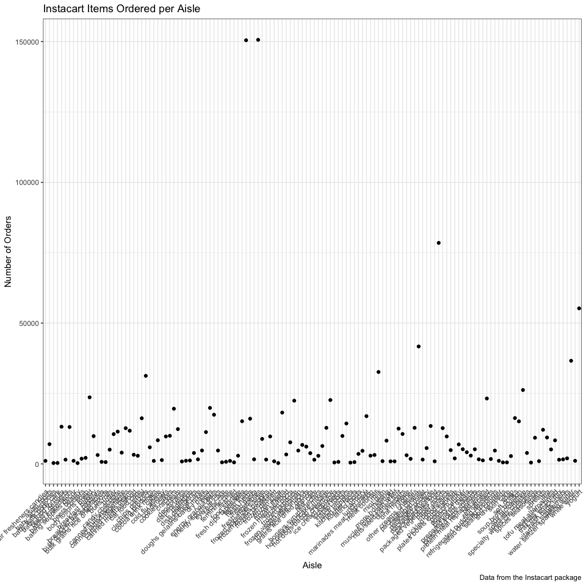

p8105\_hw3\_dk2759
================
Darwin Keung
2018-10-14

``` r
library(tidyverse)
```

    ## ── Attaching packages ────────────────────────────────────────────────────────────────── tidyverse 1.2.1 ──

    ## ✔ ggplot2 3.0.0     ✔ purrr   0.2.5
    ## ✔ tibble  1.4.2     ✔ dplyr   0.7.6
    ## ✔ tidyr   0.8.1     ✔ stringr 1.3.1
    ## ✔ readr   1.1.1     ✔ forcats 0.3.0

    ## ── Conflicts ───────────────────────────────────────────────────────────────────── tidyverse_conflicts() ──
    ## ✖ dplyr::filter() masks stats::filter()
    ## ✖ dplyr::lag()    masks stats::lag()

``` r
library(ggridges)
```

    ## 
    ## Attaching package: 'ggridges'

    ## The following object is masked from 'package:ggplot2':
    ## 
    ##     scale_discrete_manual

``` r
library(dplyr)
library(haven)
```

knitr::opts\_chunk$set( fig.width = 6, fig.asp = .6, out.width = “90%” )

theme\_set(theme\_bw() + theme(legend.position = “bottom”))

Homework 3 Context This assignment reinforces ideas in Visualization and
EDA.

Due date Due: October 15 at 4:00pm.

Points Problem 0: 10 points Problem 1: 30 points Problem 2: 30 points
Problem 3: 30 points Problem 0 This “problem” focuses on structure of
your submission, especially the use git and GitHub for reproducibility,
R Projects to organize your work, R Markdown to write reproducible
reports, relative paths to load data from local files, and reasonable
naming structures for your files.

To that end:

create a public GitHub repo + local R Project; we suggest naming this
repo / directory p8105\_hw3\_YOURUNI (e.g. p8105\_hw3\_ajg2202 for
Jeff), but that’s not required create a single .Rmd file named
p8105\_hw3\_YOURUNI.Rmd that renders to github\_document Your solutions
to Problems 1, 2, and 3 should be implemented in your .Rmd file, and
your git commit history should reflect the process you used to solve
these Problems.

For this Problem, we will assess adherence to the instructions above
regarding repo structure, git commit history, and whether we are able to
knit your .Rmd to ensure that your work is reproducible. Adherence to
appropriate styling and clarity of code will be assessed in Problems 1+
using the homework style rubric.

This homework includes figures; the readability of your embedded plots
(e.g. font sizes, axis labels, titles) will be assessed in Problems 1+.

## Problem 1

This problem uses the BRFSS data. DO NOT include this dataset in your
local data directory; instead, load the data from the p8105.datasets
package.

``` r
library(p8105.datasets)
```

#### Read and clean BRFSS data

Load the BRFSS data from the `p8105.datasets` package.

``` r
data(brfss_smart2010)
```

Cleaning \* format the data to use appropriate variable names; \* focus
on the “Overall Health” topic \* include only responses from “Excellent”
to “Poor” \* organize responses as a factor taking levels ordered from
“Excellent” to “Poor”

``` r
brfss_smart2010_factor =
  brfss_smart2010 %>% 
  janitor::clean_names() %>% 
  filter(topic == "Overall Health") %>% 
  mutate(response = fct_relevel(response, c("Excellent", "Very good", "Good", "Fair", "Poor"))) %>%
  janitor::clean_names()  %>%
  arrange(response)
```

#### Questions

In 2002, which states were observed at 7 locations? ANS: CT, FL, NC have
7 distinct observation locations.

``` r
brfss_smart2010_factor %>% 
  filter(year == 2002) %>% 
  group_by(locationabbr) %>% 
  distinct(locationdesc) %>% 
  count() %>% 
  filter(n == 7)
```

    ## # A tibble: 3 x 2
    ## # Groups:   locationabbr [3]
    ##   locationabbr     n
    ##   <chr>        <int>
    ## 1 CT               7
    ## 2 FL               7
    ## 3 NC               7

Make a “spaghetti plot” that shows the number of locations in each state
from 2002 to 2010.

``` r
brfss_smart2010_plot = brfss_smart2010_factor %>% 
  group_by(locationabbr, year) %>% 
  distinct(locationdesc) %>%
  summarize(n_obs = n())

ggplot(brfss_smart2010_plot, aes(x = year, y = n_obs)) + 
  geom_line(aes(color = locationabbr), alpha = .5) +
  labs(
    title = "BRFSS Observation Locations by State from 2002 to 2010",
    x = "Year",
    y = "Number of Locations",
    caption = "Data from the BRFSS package"
  ) + 
  viridis::scale_color_viridis(
    name = "State", 
    discrete = TRUE
  )
```

<!-- -->

Make a table showing, for the years 2002, 2006, and 2010, the mean and
standard deviation of the proportion of “Excellent” responses across
locations in NY State.

``` r
brfss_smart2010_factor %>% 
  filter(locationabbr == "NY", year == 2002 | year == 2006 | year == 2010, 
         response == "Excellent") %>% 
  group_by(year, locationdesc, locationabbr) %>%
  spread(key = response, value = data_value) %>% 
  janitor::clean_names() %>%
  summarize(mean_excellent = mean(excellent), 
            sd_excellent = sd(excellent, na.rm = TRUE)) %>% 
  mutate(mean_excellent = 
           mean_excellent / 100, sd_excellent = sd_excellent / 100) %>% 
  knitr::kable(digits = 3)
```

| year | locationdesc            | locationabbr | mean\_excellent | sd\_excellent |
| ---: | :---------------------- | :----------- | --------------: | ------------: |
| 2002 | NY - Kings County       | NY           |           0.195 |            NA |
| 2002 | NY - Nassau County      | NY           |           0.269 |            NA |
| 2002 | NY - New York County    | NY           |           0.279 |            NA |
| 2002 | NY - Queens County      | NY           |           0.188 |            NA |
| 2002 | NY - Suffolk County     | NY           |           0.271 |            NA |
| 2006 | NY - Kings County       | NY           |           0.192 |            NA |
| 2006 | NY - Nassau County      | NY           |           0.217 |            NA |
| 2006 | NY - New York County    | NY           |           0.288 |            NA |
| 2006 | NY - Queens County      | NY           |           0.189 |            NA |
| 2006 | NY - Suffolk County     | NY           |           0.206 |            NA |
| 2006 | NY - Westchester County | NY           |           0.260 |            NA |
| 2010 | NY - Bronx County       | NY           |           0.176 |            NA |
| 2010 | NY - Erie County        | NY           |           0.172 |            NA |
| 2010 | NY - Kings County       | NY           |           0.224 |            NA |
| 2010 | NY - Monroe County      | NY           |           0.224 |            NA |
| 2010 | NY - Nassau County      | NY           |           0.262 |            NA |
| 2010 | NY - New York County    | NY           |           0.258 |            NA |
| 2010 | NY - Queens County      | NY           |           0.212 |            NA |
| 2010 | NY - Suffolk County     | NY           |           0.246 |            NA |
| 2010 | NY - Westchester County | NY           |           0.269 |            NA |

## not sure how to do make my SDs not NAs?

summarize(mean\_excellent = mean((response == “Excellent” \*
sample\_size))/sample\_size), na.rm = TRUE, standard\_deviation =
sd(response == “Excellent”, na.rm = TRUE)) %\>%

For each year and state, compute the average proportion in each response
category (taking the average across locations in a state). Make a
five-panel plot that shows, for each response category separately, the
distribution of these state-level averages over time.

``` r
brfss_smart2010_factor %>% 
  group_by(year, locationabbr, response) %>%
  summarize(mean_response = mean(data_value/100)) %>% 
  ggplot(aes(x = year, y = mean_response, color = locationabbr)) + 
  geom_line(alpha = 0.4) + 
  facet_grid(~response) +
  labs(
    title = "BRFSS Average Response by State from 2002 to 2010",
    x = "Year",
    y = "Average Response",
    caption = "Data from the BRFSS package"
  ) + 
  viridis::scale_color_viridis(
    name = "State", 
    discrete = TRUE
  )
```

    ## Warning: Removed 1 rows containing missing values (geom_path).

<!-- -->

## Problem 2

#### Read and clean Instacart data

``` r
data(instacart)
```

This problem uses the Instacart data. DO NOT include this dataset in
your local data directory; instead, load the data from the
p8105.datasets package (it’s called instacart).

The goal is to do some exploration of this dataset. To that end, write a
short description of the dataset, noting the size and structure of the
data, describing some key variables, and giving illustrative examples of
observations. Then, do or answer the following (commenting on the
results of each):

#### Summarize

This dataset has 1384617 observations and 15 variables. Other than
`eval_set`, `product_name`, `aisle`, and `department`, all variables are
class `integer`. There are **134 aisles** and **21 departments** selling
a total of **39123 unique products**

#### Questions

How many aisles are there, and which aisles are the most items ordered
from? There are **134 aisles**. `Fresh vegetables` and `fresh fruits`
have the most ordered items.

``` r
instacart %>%
  group_by(aisle) %>% 
  count(aisle) %>%
  rename(count_aisle = n) %>% 
  arrange(desc(count_aisle)) %>%
  head() %>% 
  knitr::kable()
```

| aisle                         | count\_aisle |
| :---------------------------- | -----------: |
| fresh vegetables              |       150609 |
| fresh fruits                  |       150473 |
| packaged vegetables fruits    |        78493 |
| yogurt                        |        55240 |
| packaged cheese               |        41699 |
| water seltzer sparkling water |        36617 |

Make a plot that shows the number of items ordered in each aisle. Order
aisles sensibly, and organize your plot so others can read it.

The code below plots number of items order in each aisle. People really
really like to order fruits and veggies over other items by far.

``` r
instacart_plot = instacart %>%
  group_by(aisle, aisle_id) %>% 
  count(aisle) %>%
  rename(count_aisle = n) %>%
  arrange(desc(aisle_id))

ggplot(instacart_plot, aes(x = aisle, y = count_aisle)) + 
  geom_point(aes()) +
  labs(
    title = "Instacart Items Ordered per Aisle",
    x = "Aisle",
    y = "Number of Orders",
    caption = "Data from the Instacart package"
  ) + 
  theme(axis.text.x = element_text(angle = 45, hjust = 1))
```

<!-- -->

Make a table showing the most popular item in each of the aisles “baking
ingredients”, “dog food care”, and “packaged vegetables fruits”.

The code below produces this table. From baking ingredients: zero
calorie sweetener; dog food care: zero grain turkey dog food; packaged
vegetables fruits: Zucchini Squash, Baby Courgette.

``` r
instacart %>%
  filter(
    aisle == "baking ingredients" | 
    aisle == "dog food care" | 
    aisle == "packaged vegetables fruits") %>%
  group_by(aisle) %>% 
  summarize(popular_item = max(product_name)) %>% 
  head() %>% 
  knitr::kable()
```

| aisle                      | popular\_item                   |
| :------------------------- | :------------------------------ |
| baking ingredients         | Zero Calorie Sweetener          |
| dog food care              | Zero Grain Turkey Dog Food      |
| packaged vegetables fruits | Zucchini Squash, Baby Courgette |

Make a table showing the mean hour of the day at which Pink Lady Apples
and Coffee Ice Cream are ordered on each day of the week; format this
table for human readers (i.e. produce a 2 x 7 table).

``` r
instacart %>%
  filter(
    product_name == "Pink Lady Apples" | 
    product_name == "Coffee Ice Cream")  %>%
  group_by(product_name, order_hour_of_day) %>% 
  summarize(popular_item = max(product_name)) %>% 
  head() %>% 
  knitr::kable()
```

| product\_name    | order\_hour\_of\_day | popular\_item    |
| :--------------- | -------------------: | :--------------- |
| Coffee Ice Cream |                    1 | Coffee Ice Cream |
| Coffee Ice Cream |                    2 | Coffee Ice Cream |
| Coffee Ice Cream |                    5 | Coffee Ice Cream |
| Coffee Ice Cream |                    7 | Coffee Ice Cream |
| Coffee Ice Cream |                    8 | Coffee Ice Cream |
| Coffee Ice Cream |                    9 | Coffee Ice Cream |

## Problem 3

This problem uses the NY NOAA data. DO NOT include this dataset in your
local data directory; instead, load the data from the p8105.datasets
package (it’s called ny\_noaa).

The goal is to do some exploration of this dataset. To that end, write a
short description of the dataset, noting the size and structure of the
data, describing some key variables, and indicating the extent to which
missing data is an issue. Then, do or answer the following (commenting
on the results of each):

Do some data cleaning. Create separate variables for year, month, and
day. Ensure observations for temperature, precipitation, and snowfall
are given in reasonable units. For snowfall, what are the most commonly
observed values? Why? Make a two-panel plot showing the average max
temperature in January and in July in each station across years. Is
there any observable / interpretable structure? Any outliers? Make a
two-panel plot showing (i) tmax vs tmin for the full dataset (note that
a scatterplot may not be the best option); and (ii) make a plot showing
the distribution of snowfall values greater than 0 and less than 100
separately by year.
